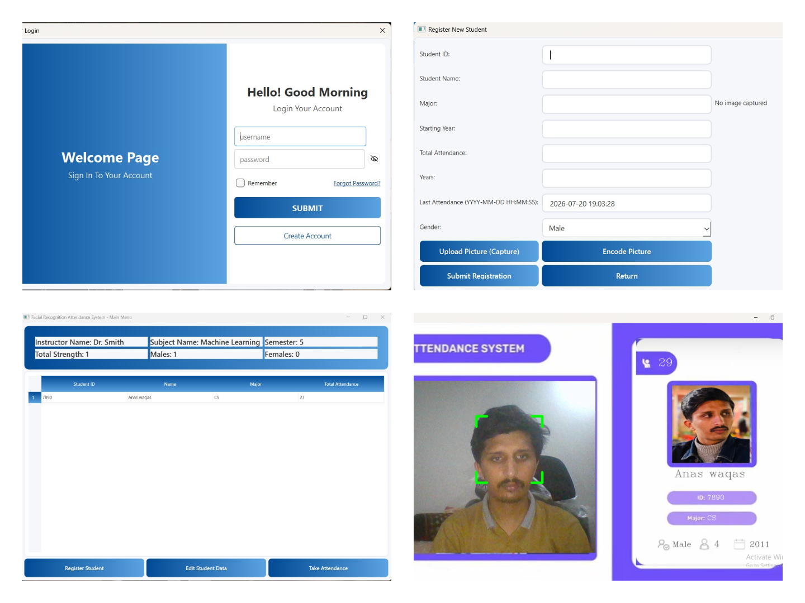
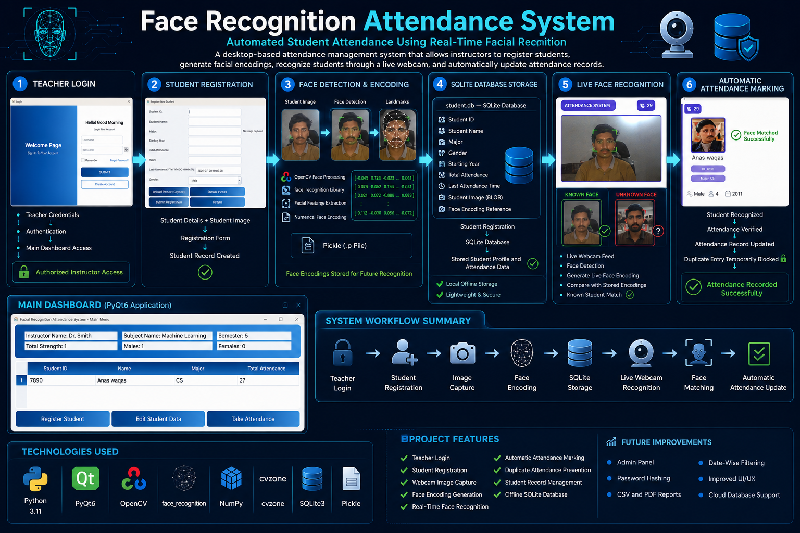

# Face Recognition Attendance System

A desktop-based Face Recognition Attendance System built with **Python**, **OpenCV**, **face_recognition**, **SQLite**, and **PyQt6**. The project allows a teacher/instructor to register students, store their face encodings, and mark attendance through live camera face recognition.



##Workflow


## Overview

This project is designed to automate student attendance using facial recognition. It includes:

* Student registration with image capture
* Face encoding generation
* Attendance marking through webcam
* Student data management
* Login interface for teacher access
* Local SQLite database storage

## Features

* **Teacher Login Screen**

  * Secure login dialog before accessing the main dashboard

* **Student Registration**

  * Add new students with ID, name, major, gender, year, attendance, and photo
  * Capture student image from webcam
  * Save image as BLOB in SQLite database
  * Generate and store face encodings

* **Face Recognition Attendance**

  * Detect faces from live webcam feed
  * Match against stored encodings
  * Update attendance automatically
  * Prevent duplicate attendance marking within a short time window

* **Student Management**

  * View total students
  * View male/female count
  * Edit student records
  * Delete student records

* **Local Database Storage**

  * Uses SQLite for offline and lightweight data storage
  * All records remain inside the project folder

## Tech Stack

* **Python 3.11.X**
* **PyQt6**
* **OpenCV**
* **face_recognition**
* **NumPy**
* **cvzone**
* **SQLite3**
* **Pickle**

## Project Structure

```text
Face_Recognition_Project/
├── Images/
├── Resources/
      └── background.jpg
      └──modes
             └──img1.jpg
             └──img2.jpg
             └──img3.jpg
             └──img4.jpg
├── database.py
├── EncodingGenerator.py
├── GUI_FOR_PROJ.py
├── proj.py
├── EncodeFile.p
├── student.db
├── open-eye.png
├── close-eye.png
```
## Requirements

Install the required packages before running the project:

```bash
pip install opencv-python face_recognition numpy cvzone PyQt6
```

> Note: `face_recognition` may require `dlib` and build tools depending on your system.

## Installation

1. Clone the repository:

```bash
git clone https://github.com/your-username/your-repo-name.git
```

2. Go to the project folder:

```bash
cd Face_Recognition_Project
```

3. Create and activate a virtual environment:

```bash
python -m venv .venv
.venv\Scripts\activate
```

## How to Run

### 1. Start the GUI

```bash
python GUI_FOR_PROJ.py
```

### 2. Register Students

* Open the application
* Log in with the teacher credentials
* Click **Register Student**
* Enter student details
* Capture image and encode face
* Submit the registration

### 3. Generate Encodings Manually

If needed, run the encoding generator after adding images:

```bash
python EncodingGenerator.py
```

### 4. Take Attendance

* Click **Take Attendance**
* The webcam will open
* Attendance will be marked automatically when a known face is detected

## Login Credentials

Default login credentials used in the project:

* **Username:** teacher
* **Password:** password

> Change these before using the project in a real environment.

## Database

The project uses a local SQLite database named `student.db`.

### Students Table Fields

* `student_id`
* `student_name`
* `major`
* `starting_year`
* `total_attendance`
* `years`
* `last_attendance_time`
* `student_image`
* `Gender`

## Screenshots

Add your main application screenshot here and keep the file name exactly:

* `screenshot.png`

Example:

```markdown

```

## Future Improvements

* Add admin panel
* Add password hashing for login
* Export attendance reports to CSV/PDF
* Add date-wise attendance filtering
* Add improved UI/UX design
* Add cloud database support

## License

This project is open for educational use. Add your preferred license before publishing.

## Author

Anas waqas


